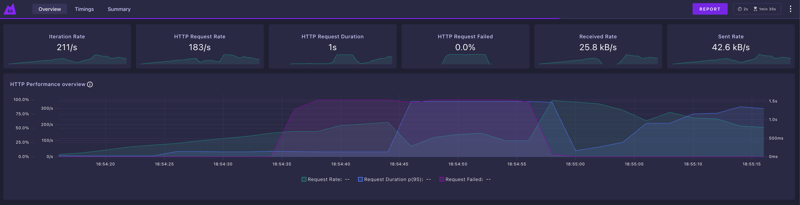
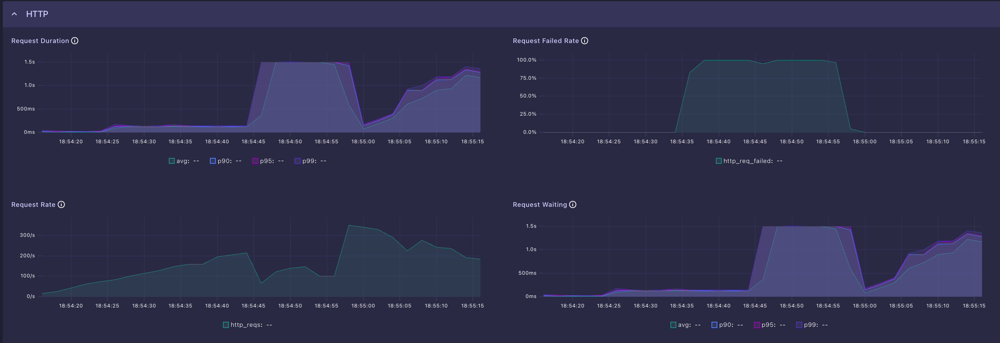
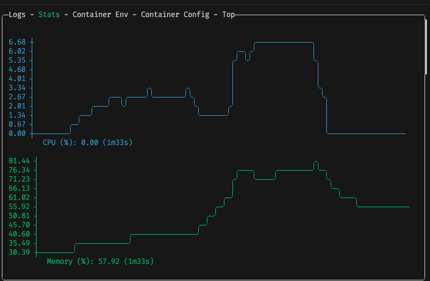
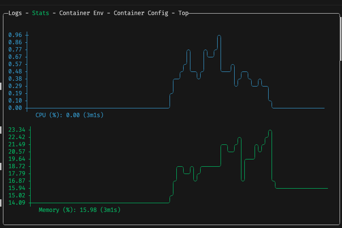

### ⚠️ This is a halfway test to see how consistent the payments are when running with only one instance

#### Major things still missing:

> Some shared storage between the instances

I need to keep the summary consistent with the payment data processed in each instance. I still want to use only distributed Gleam here, but if that's not possible then Redis will be enough.

> General fine tuning

Little things like creating the same decoder/encoder over and over again add up, but I'll only have a look at them at the end if I'm not happy with the performance.


#### K6 Results below

```
data_received	1.09 MB	17.4 kB/s
data_sent	2.04 MB	32.3 kB/s
default_total_amount	158.2k	2.51k/s
default_total_fee	11.1k	175.81/s
default_total_requests	8k	126.21/s
fallback_total_amount	477.6	7.58/s
fallback_total_fee	47.8	0.76/s
fallback_total_requests	24	0.38/s
http_reqs	10.1k	160.81/s
iterations	10.1k	160.21/s
payments_inconsistency	20	0.32/s
total_transactions_amount	158.7k	2.52k/s
transactions_failure	3.2k	50.49/s
transactions_success	6.9k	109.52/s
```

---

K6 Overview:



---

K6 Timings:



---

Single API instance stats:



---

Nginx stats:


